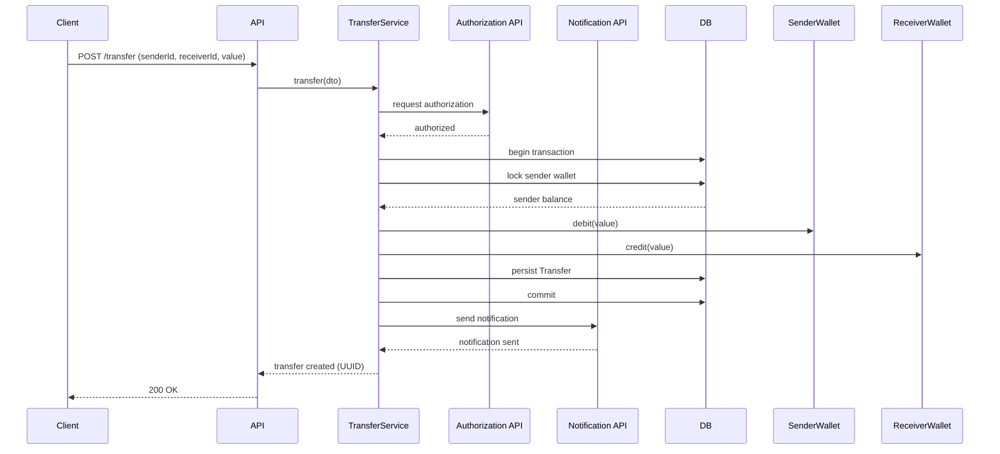

# digital-wallet-api

API simples de carteira (Java + Spring). Com o objetivo de criar wallets e realizar transferências. Erros seguem RFC 7807 (`application/problem+json`).

## Regra de negócio

### Wallet
- Wallet deve ser única por **cpfCnpj** e **email** → duplicidade.
- Tipos:
  - **USER**: pode enviar e receber transferências.
  - **MERCHANT**: pode apenas receber.

### Transferência
Uma transferência só é concluída quando:

- **Wallets existem** → senão **404 Not Found**.
- **Pagador é USER** → MERCHANT não pode enviar (**422**).
- **Saldo suficiente** → senão **422 Unprocessable Entity**.
- **Autorização externa aprovada** → se negar, cancelar operação.
- Executada com **@Transactional** para garantir atomicidade  
  (debitar, creditar e salvar `Transfer`; qualquer erro gera rollback).

### Garantias
- Nenhuma transferência gera saldo negativo.
- Nenhuma operação financeira é parcialmente concluída.
- Erros seguem **RFC 7807 (`application/problem+json`)**.


## Endpoints
1) Criar wallet
- POST /wallets
- Body: CreateWalletDto
- Sucesso: 200 OK (corpo: Wallet)
- Erro de duplicidade: 422 Conflict (RFC 7807)
- Validação DTO: 400 Bad Request (RFC 7807)

2) Transferência
- POST /transfer
- Body: TransferDto
- Sucesso: 200 OK (corpo: Transfer)
- Possíveis erros: 400, 404, 422 (ex.: saldo insuficiente) — todos em RFC 7807

## Exemplos

Criar wallet:
```bash
curl -s -X POST http://localhost:8080/wallets \
  -H "Content-Type: application/json" \
  -d '{
    "fullName":"João Silva",
    "cpfCnpj":"12345678901",
    "email":"joao@example.com",
    "password":"senha123",
    "walletType":"PERSONAL"

  }'
```

Transferir:

```bash
curl -s -X POST http://localhost:8080/transfer \
  -H "Content-Type: application/json" \
  -d '{
    "value":100.50,
    "payer":1,
    "payee":2
  }'
```

Exemplo de erro (duplicidade — RFC 7807):

```bash
{
  "title":"Wallet data already exists",
  "status":422,
  "detail":"Cpf/Cnpj or Email already exists",
  "instance":"/wallets"
}
```

# Fluxo de transferência




# Como rodar

1. Ajuste `application.properties` (DB).

2. Build:
```bash
./mvnw clean package
```

3. Run:
```bash
java -jar target/<app>.jar
```


  
